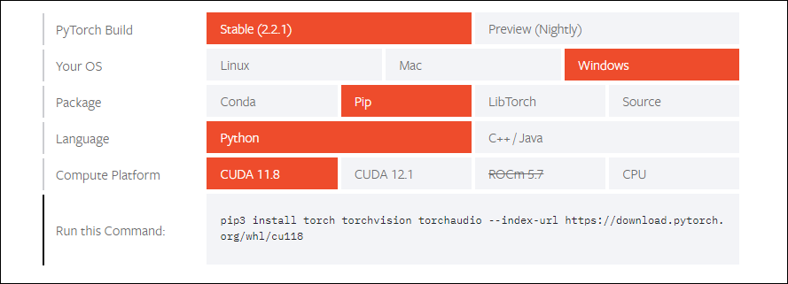

# Pytorch beginner course

In this repository I implements some exercises that contains the bases about the `pytorch` module *(or Keras on a few scenarios)*, I made this repo in order to improve my practical skills about machine learning models, for this reason it's possible that into the projects you can find some misstake.

PyTorch offers various domain-specific libraries that extend its core capabilities, such as:
- **TorchVision**: For computer vision tasks, providing datasets, models, and image transformations.
- **TorchText**: For natural language processing, offering datasets and text processing utilities.
- **TorchAudio**: For audio processing, including datasets and transformations for audio data.

# How to install pytorch

To install pytorch visit the official web site or use any package manager like:

-  `conda`
-  `pip`

You can do an customized installation using the installation tool on pytorch web site [Pytorch installation tool](https://pytorch.org/get-started/locally/).



# How to check torch version

In your python source code insert this line of code:

```python
import torch

version = torch.__version__
print(version)
```

# Prerequisites

I suggest to have a basic knowledge of:

- Machine Learning theory (most important)
- `Numpy` (reccommended)
- `Matplotlib` (reccommended)
- `Pandas` library (optional)


# References

[Pytorch](https://pytorch.org/)

[Pytorch basics](https://docs.pytorch.org/tutorials/beginner/basics/intro.html)

[Tensorflow](https://www.tensorflow.org/?hl=it)
